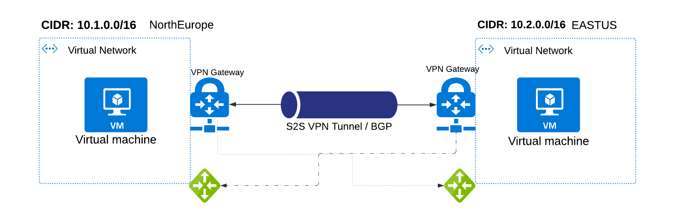

# Vnet to Vnet S2S BGP

## Scope
- Vnet-to-Vnet S2S BGP peering connection.

## Prerequsites
- [terraform](https://developer.hashicorp.com/terraform/tutorials/aws-get-started/install-cli)
- [azure cli](https://learn.microsoft.com/en-us/cli/azure/install-azure-cli) & [sign in](https://learn.microsoft.com/en-us/cli/azure/authenticate-azure-cli)

1. Clone this [repo](https://docs.github.com/en/repositories/creating-and-managing-repositories/cloning-a-repository) and change below parameters or keep default. 
**Note**: Change these parameters described in later steps: **vpngw_bgp_peering_address** and
 **vpngw2_bgp_peering_address**
```
variable "resource_group_location" {
  default     = "northeurope"
  description = "Location of the resource group."
}

# --- VPNGW1 ----

variable "vnet1_cidr" {
  default = ["10.4.0.0/16"]
  description = "azure vnet cidr"
}
variable "vnet1_subnet_address" {
  default = ["10.4.1.0/24"]
}
variable "vnet1_gateway_subnet_address" {
  default = ["10.4.3.0/27"]
}
variable "vnet1_bastion_subnet_address" {
  default = ["10.4.4.0/24"]
}
variable "vpngw_bgp_peering_address" {
  default = "10.4.3.30"
  description = "Enter this value after creating vpn gateway, as of now keep default"
}

# --- VPNGW2 ----
variable "vnet2_cidr" {
  default = ["10.6.0.0/16"]
  description = "azure vnet cidr"
}
variable "vnet2_subnet_address" {
  default = ["10.6.1.0/24"]
}
variable "vnet2_gateway_subnet_address" {
  default = ["10.6.3.0/27"]
}
variable "vnet2_bastion_subnet_address" {
  default = ["10.6.4.0/24"]
}
variable "vpngw2_bgp_peering_address" {
  default = "10.6.3.30"
  description = "Enter this value after creating vpn gateway, as of now keep default"
}
```
2. execute below cmds: (Goto dir: /site-to-site-terrafrom)
   - terraform init
   - terraform plan
   - terraform apply

**Note**: If fails, try to execute: *terraform init -upgrade* on terminal and execute cmd: *terraform apply --auto-approve*.

3. This is a tricky part somehow terrafrom doesn't allow to import the vpn gateway private ip. 

- Copy both the Virtual Network Gateway **BGP peer IP address** shown in below pic:
   

- Paste the bgp peer ip in above *variables.tf* file for parameters: 
- - **vpngw_bgp_peering_address** 
- - **vpngw2_bgp_peering_address**

4. Execute the command in terminal: **terraform apply**
  
5. Connect the VM's using bastion host:
   - In global search, Navigate to your Virtual Machines.
   - Click: connect -> bastion
   
6. Open browser enter destination VM private ip.

Links: 
- [https://learn.microsoft.com/en-us/azure/vpn-gateway/bgp-howto](https://learn.microsoft.com/en-us/azure/vpn-gateway/bgp-howto)
